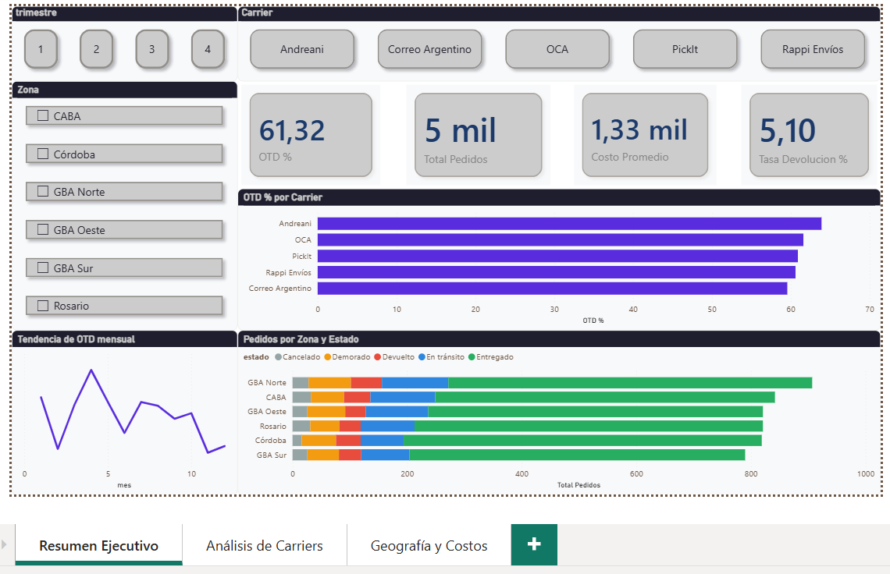
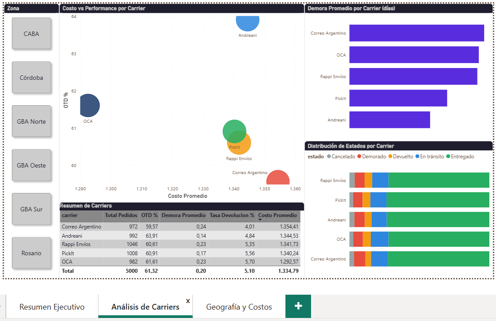
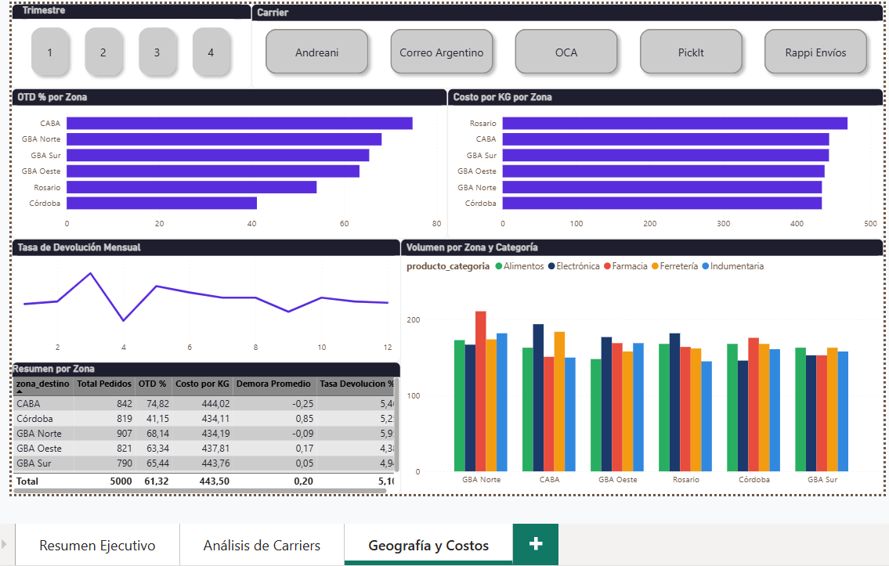

# 🚚 Pipeline de Analytics Logístico

Proyecto end-to-end de análisis de operaciones logísticas: 
generación de datos, pipeline ETL, análisis SQL y dashboard ejecutivo en Power BI.

---

## 📊 Hallazgos principales

- **OTD global del 61.3%** — indica un problema sistémico de entregas a resolver
- **Córdoba tiene el peor OTD (41.1%)** versus CABA que lidera con 74.8%
- **Andreani es el carrier más confiable** (63.9% OTD, menor demora promedio)
- **Correo Argentino tiene el peor desempeño** (59.6% OTD, mayor costo promedio)
- **Rappi Envíos en CABA alcanza 77.6% OTD** — los carriers urbanos rinden mejor en ciudad
- **Febrero y Noviembre son los meses críticos** con OTD por debajo del 58%

---

## 🖼️ Dashboard

### Resumen Ejecutivo


### Análisis de Carriers


### Geografía y Costos


---

## 🏗️ Arquitectura del pipeline
Raw Data (CSV/XLSX)
↓
Python ETL
(limpieza + features)
↓
Tablas Analíticas          SQL Queries
(fact_orders, kpis)   →   (DuckDB)
↓
Power BI Dashboard
(3 páginas ejecutivas)
---

## 🛠️ Stack tecnológico

| Herramienta | Uso |
|-------------|-----|
| Python · pandas · numpy | Generación de datos y ETL |
| Faker | Datos sintéticos realistas |
| DuckDB · SQL | Análisis exploratorio y KPIs |
| Power BI · DAX | Dashboard ejecutivo |
| Excel | Fuente de datos consolidada |

---

## 📁 Estructura del proyecto
proyecto-pipeline/
├── data/
│   ├── raw/                  # Dataset original generado
│   │   ├── logistics_raw.csv
│   │   ├── logistics_raw.xlsx
│   │   └── eda_overview.png
│   └── processed/            # Tablas post-ETL
│       ├── fact_orders.csv
│       ├── kpi_carrier.csv
│       ├── kpi_zona.csv
│       ├── kpi_mes.csv
│       └── logistics_analytics.xlsx
├── src/
│   ├── generate_data.py      # Generación del dataset
│   ├── eda.py                # Análisis exploratorio
│   └── etl.py                # Pipeline ETL
├── sql/
│   ├── analysis.sql          # Queries de negocio
│   └── run_queries.py        # Ejecución con DuckDB
├── dashboards/
│   ├── logistics_dashboard.pbix
│   └── logistics_dashboard.pdf
├── docs/
│   ├── resumen_ejecutivo.png
│   ├── analisis_carriers.png
│   └── geografia_costos.png
└── README.md
---

## 🚀 Cómo reproducir el proyecto

```bash
# 1. Clonar el repositorio
git clone https://github.com/ErickDorado/proyecto-pipeline-logistico
cd proyecto-pipeline-logistico

# 2. Instalar dependencias
pip install pandas numpy faker openpyxl matplotlib seaborn duckdb

# 3. Generar el dataset
python src/generate_data.py

# 4. Exploración de datos
python src/eda.py

# 5. Ejecutar el ETL
python src/etl.py

# 6. Correr queries SQL
python sql/run_queries.py

# 7. Abrir el dashboard
# Abrir dashboards/logistics_dashboard.pbix en Power BI Desktop
```

---

## 📈 KPIs del dashboard

| KPI | Valor | Descripción |
|-----|-------|-------------|
| OTD % | 61.3% | Pedidos entregados en fecha prometida |
| Demora promedio | 0.20 días | Desvío promedio respecto al SLA |
| Costo promedio | $1.335 | Costo de envío por pedido |
| Tasa devolución | 5.1% | Pedidos devueltos sobre el total |
| Costo por KG | $443 | Eficiencia del costo logístico |

---

## 🔍 Estructura del modelo de datos

**fact_orders** — tabla principal (5.000 filas · 20 columnas)

| Campo | Tipo | Descripción |
|-------|------|-------------|
| order_id | string | Identificador único del pedido |
| fecha_pedido | date | Fecha de creación |
| carrier | string | Empresa de transporte |
| zona_destino | string | Zona geográfica de entrega |
| entrega_a_tiempo | bool | Si cumplió el SLA prometido |
| demora_dias | int | Días reales menos días prometidos |
| costo_pct_valor | float | Costo logístico como % del valor |

---

## ⚠️ Limitaciones del dataset

- Dataset sintético generado con distribuciones estadísticas controladas
- Los valores de costo representan escenarios simulados, no tarifas reales de carriers
- La cobertura geográfica está simplificada a 6 zonas del mercado argentino